# AEGIS Privacy Suite

> **Account & Enterprise Guardian Intelligence System**
>
> *Your Digital Footprint, Finally Visible*

[](LICENSE)
[](https://nodejs.org/)
[](https://www.typescriptlang.org/)
[](https://python.org/)

**GitHub**: [github.com/SoMaCoSF/aegis](https://github.com/SoMaCoSF/aegis)

---

## What is AEGIS?

Ever wonder how many accounts you've created over the years? Which ones have 2FA? How much you're spending on subscriptions? Which companies are tracking you across the web?

**AEGIS is a local-first privacy command center that gives you complete visibility and control over your digital footprint.**

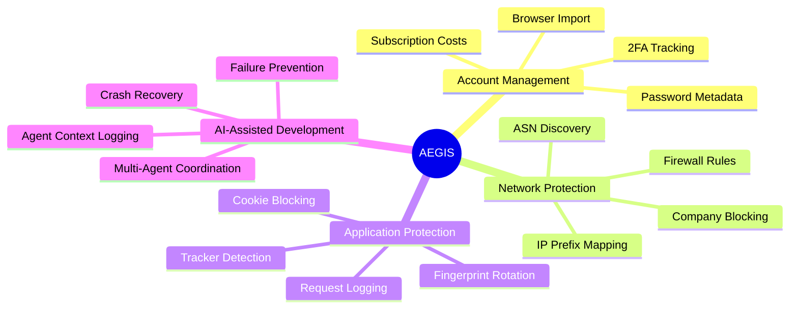

### Key Capabilities

| Feature | Description |
|---------|-------------|
| **Account Import** | Import from Chrome, Firefox, Brave, Edge, Bitwarden, LastPass, 1Password |
| **Subscription Tracking** | Track all recurring payments with cost analysis |
| **GitHub Auditing** | Audit OAuth apps, SSH keys, deploy keys for suspicious access |
| **Network Blocking** | Block entire companies at IP prefix level (not just domains) |
| **Fingerprint Protection** | Randomize browser fingerprint to prevent tracking |
| **Cookie Control** | Block tracking cookies while allowing functional ones |
| **3D Visualization** | Interactive knowledge graph of your digital relationships |
| **AI Usage Tracking** | Monitor Claude, ChatGPT, and other AI service usage |
| **Agent System** | AI-assisted development with crash recovery and failure prevention |

**All data stays local. No cloud. No telemetry. You own your data.**

---

## Table of Contents

1. [Architecture](#architecture)
2. [Components](#components)
3. [Dashboard Pages](#dashboard-pages)
4. [Quick Start](#quick-start)
5. [DMBT - Network Protection](#dmbt---network-protection)
6. [Ghost_Shell - Application Protection](#ghost_shell---application-protection)
7. [Agent Context System](#agent-context-system)
8. [LLM Failure Prevention](#llm-failure-prevention)
9. [API Reference](#api-reference)
10. [Database Schemas](#database-schemas)
11. [Security Model](#security-model)
12. [Contributing](#contributing)

---

## Architecture

### System Overview

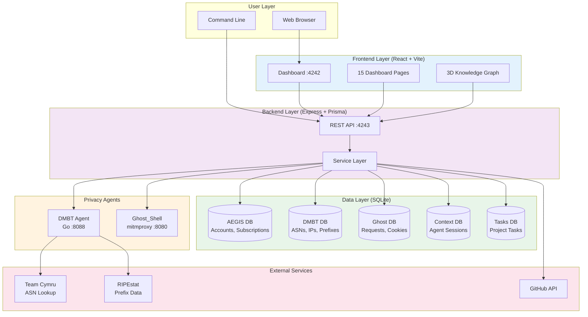

### Data Flow

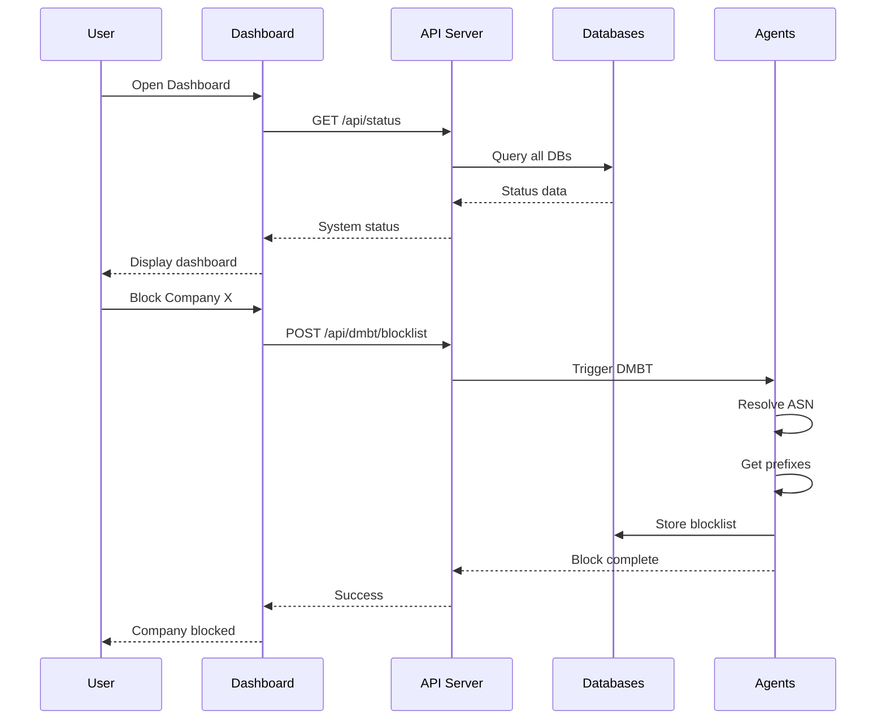

---

## Components

### Component Architecture

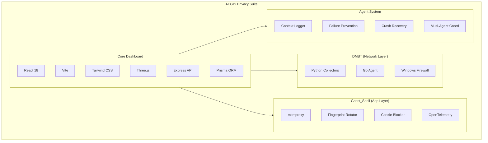

### Service Ports

| Service | Port | Protocol | Description |
|---------|------|----------|-------------|
| Dashboard | 4242 | HTTP | React web UI |
| API Server | 4243 | HTTP | Express REST API |
| DMBT Agent | 8088 | HTTP | Network intelligence agent |
| Ghost_Shell | 8080 | HTTP/S | Intercepting proxy |

---

## Dashboard Pages

### Page Overview (15 Pages)

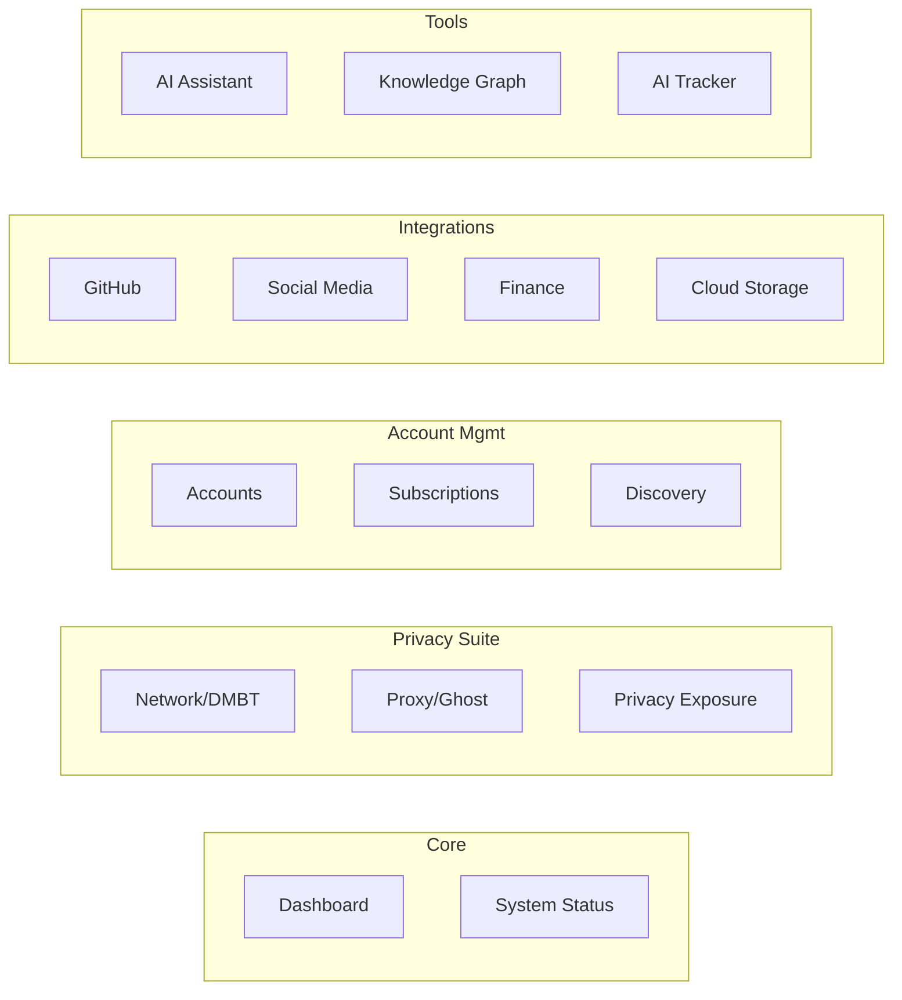

### Page Details

| Category | Page | Route | Description |
|----------|------|-------|-------------|
| **Core** | Dashboard | `/` | Overview with stats, charts, recent activity |
| | System Status | `/status` | Health check for all integrations |
| **Privacy** | Network | `/network` | DMBT control - ASN/prefix blocking |
| | Proxy | `/proxy` | Ghost_Shell - fingerprint/cookie settings |
| | Privacy Exposure | `/privacy` | Data broker tracking and removal |
| **Accounts** | Accounts | `/accounts` | Imported accounts with 2FA status |
| | Subscriptions | `/subscriptions` | Recurring payments with cost analysis |
| | Discovery | `/discovery` | Find accounts from browsing history |
| **Integrations** | GitHub | `/github` | OAuth apps, SSH keys, deploy keys |
| | Social | `/social` | Twitter, Reddit, LinkedIn tracking |
| | Finance | `/finance` | Trading accounts (Alpaca, Coinbase) |
| | Cloud | `/cloud` | Google Drive, Dropbox, OneDrive |
| **Tools** | Assistant | `/assistant` | Claude Code integration |
| | Knowledge Graph | `/graph` | 3D visualization with Three.js |
| | AI Tracker | `/ai` | Claude, ChatGPT usage monitoring |

---

## Quick Start

### Prerequisites

- **Node.js** 20+
- **Python** 3.12+ (with `uv` package manager)
- **Windows** 10/11
- **PowerShell** 7+
- **GitHub CLI** (`gh`) - for GitHub auditing

### Installation

```powershell
# Clone repository
git clone https://github.com/SoMaCoSF/aegis.git
cd aegis

# Install dependencies
npm install

# Generate Prisma client
npm run db:generate

# Push database schema
npm run db:push

# Start dashboard (frontend + API)
npm run dashboard
```

### Access Points

| Service | URL |
|---------|-----|
| Dashboard | http://localhost:4242 |
| API | http://localhost:4243 |
| API Health | http://localhost:4243/api/health |

### Using the Unified Launcher

```powershell
# Check status of all services
.\scripts\start-aegis.ps1 -Status

# Start everything
.\scripts\start-aegis.ps1 -All

# Start individual services
.\scripts\start-aegis.ps1 -Dashboard
.\scripts\start-aegis.ps1 -DMBT
.\scripts\start-aegis.ps1 -Ghost
```

### Import Browser Passwords

```powershell
# Interactive TUI
npm run browser:import

# Or direct CLI
cd packages/browser-parser
npx tsx src/importer.ts
```

**Supported browsers:** Chrome, Edge, Firefox, Brave, Bitwarden, LastPass, 1Password

---

## DMBT - Network Protection

**DMBT (Delete Me | Block Them)** provides network-layer privacy protection by blocking entire companies at the IP prefix level.

### How It Works

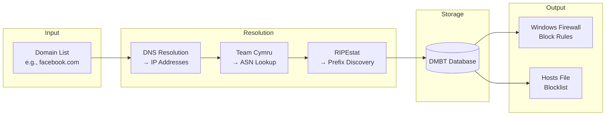

### DMBT Features

| Feature | Description |
|---------|-------------|
| **Domain Resolution** | Resolve domains to all IP addresses |
| **ASN Discovery** | Find the Autonomous System Number for each IP |
| **Prefix Mapping** | Get all IP prefixes owned by an ASN |
| **Firewall Rules** | Generate Windows Firewall blocking rules |
| **Blocklist Export** | Export as hosts file or plain text |

### Current Stats (Live System)

```
Domains Tracked: 17
IP Mappings: 38
ASNs Discovered: 5
Prefixes Mapped: 25,242
```

### Top ASNs Discovered

| ASN | Organization | IPs Found |
|-----|--------------|-----------|
| 16509 | Amazon | 17 |
| 54113 | Fastly | 8 |
| 32934 | Meta | 5 |
| 15169 | Google | 3 |

---

## Ghost_Shell - Application Protection

**Ghost_Shell** provides application-layer privacy protection through an intercepting proxy.

### Protection Layers

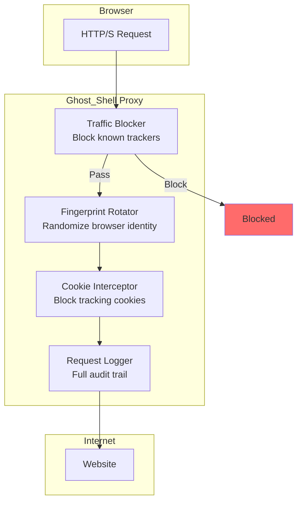

### Fingerprint Rotation Modes

| Mode | Description | Use Case |
|------|-------------|----------|
| **Static** | Fixed fingerprint per session | Normal browsing |
| **Per-Domain** | Different fingerprint per domain | Multi-account |
| **Per-Request** | New fingerprint every request | Maximum privacy |
| **Timed** | Rotate every N minutes | Balanced approach |
| **Random** | Random rotation timing | Unpredictable pattern |

### Ghost_Shell Features

| Feature | Description |
|---------|-------------|
| **User-Agent Rotation** | Randomize browser identification |
| **Accept-Language** | Vary language preferences |
| **Cookie Blocking** | Block all or selective cookies |
| **Request Logging** | Full audit trail of traffic |
| **Whitelist** | Allow trusted domains |
| **OpenTelemetry** | Distributed tracing support |

---

## Agent Context System

AEGIS includes a comprehensive agent context logging system for AI-assisted development with crash recovery.

### Agent Session Lifecycle

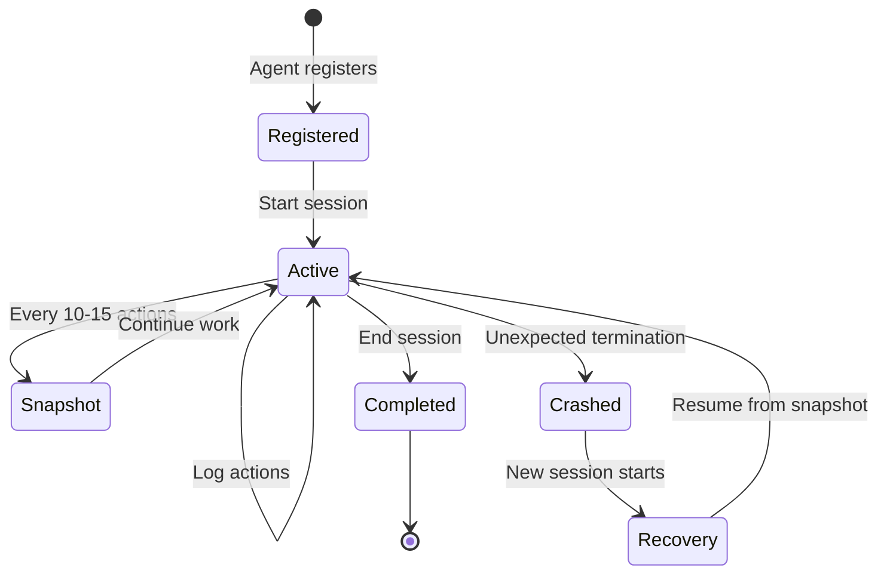

### Context Database Schema

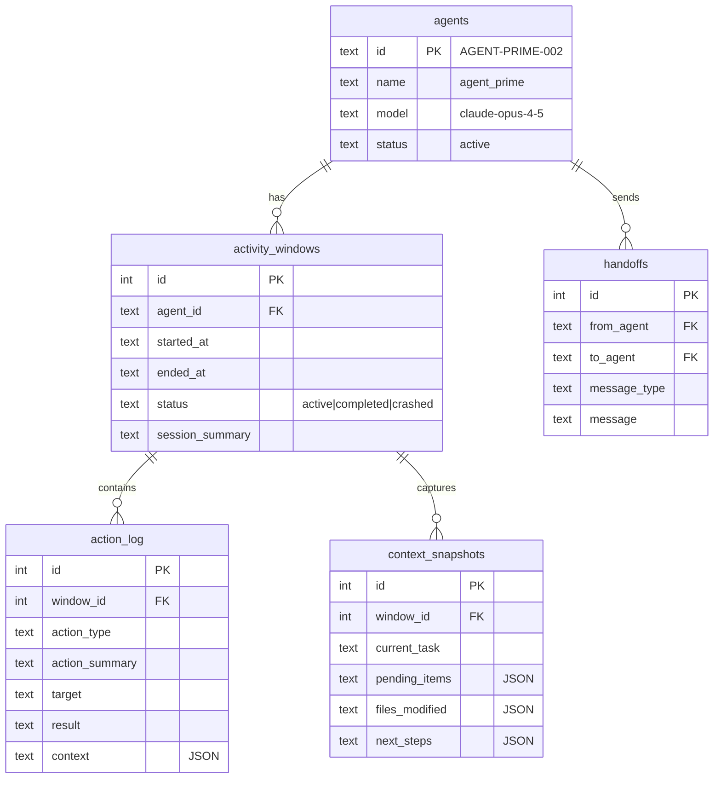

### Crash Recovery Protocol

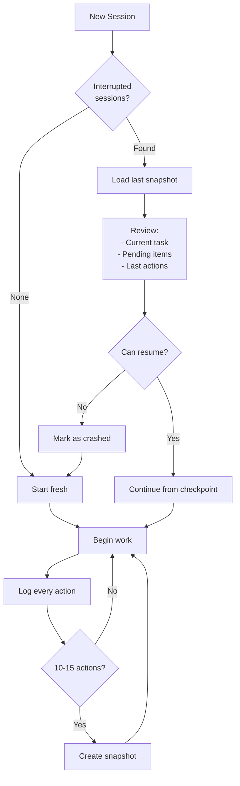

---

## LLM Failure Prevention

Based on research: *"How Do LLMs Fail In Agentic Scenarios?"* (Kamiwaza AI, 2025)

> **"Recovery capability, not initial correctness, best predicts overall success."**

### The Four Failure Archetypes

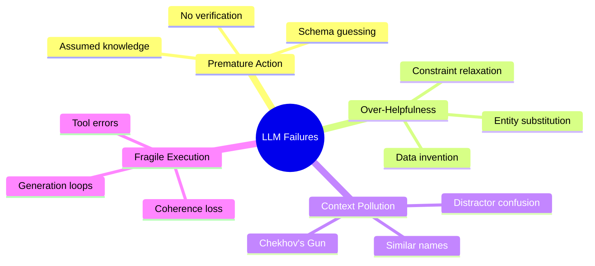

### Archetype 1: Premature Action

Acting on assumptions instead of verifying reality.

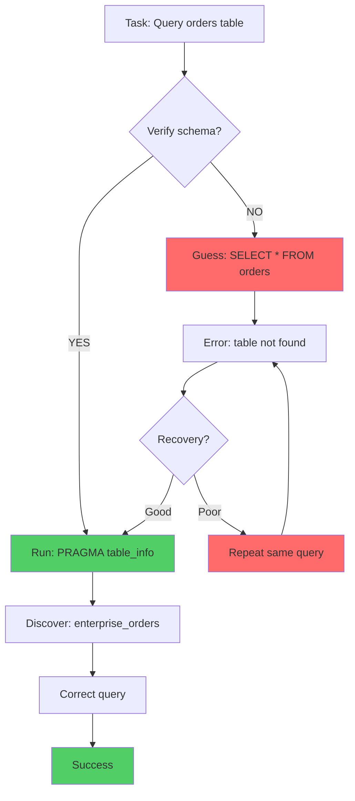

**Prevention:** Always inspect schema/file/API before acting.

### Archetype 2: Over-Helpfulness

Substituting or inventing when data is missing.

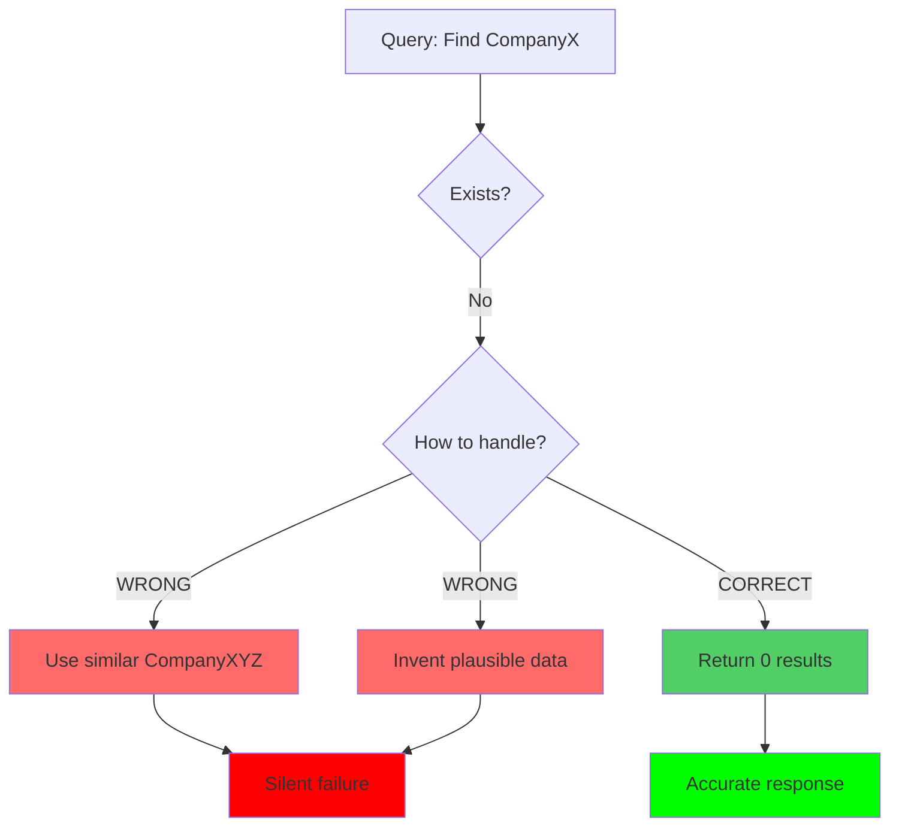

**Prevention:** If uncertain, ASK. Never substitute or invent.

### Archetype 3: Context Pollution

The "Chekhov's Gun" effect - treating all context as signal.

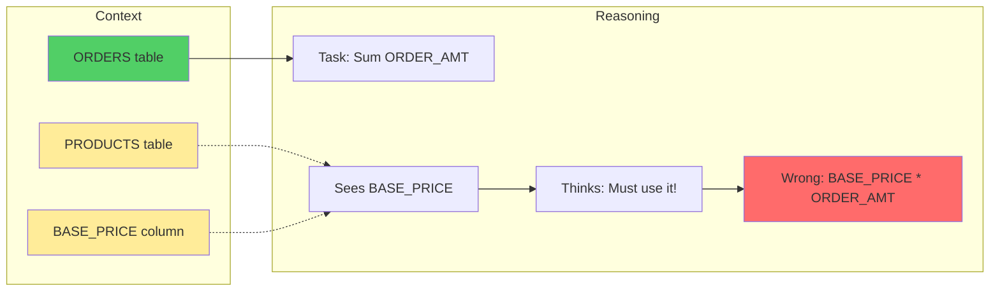

**Prevention:** Verify exact name matches. Curate context aggressively.

### Archetype 4: Fragile Execution

Coherence degradation under load.

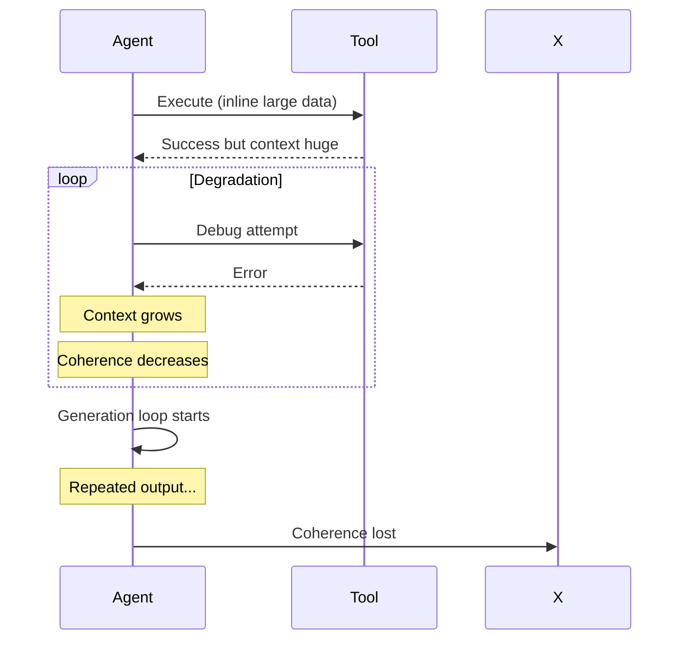

**Prevention:** Checkpoint every 3 actions. Never inline large data.

### Failure Tracking Schema

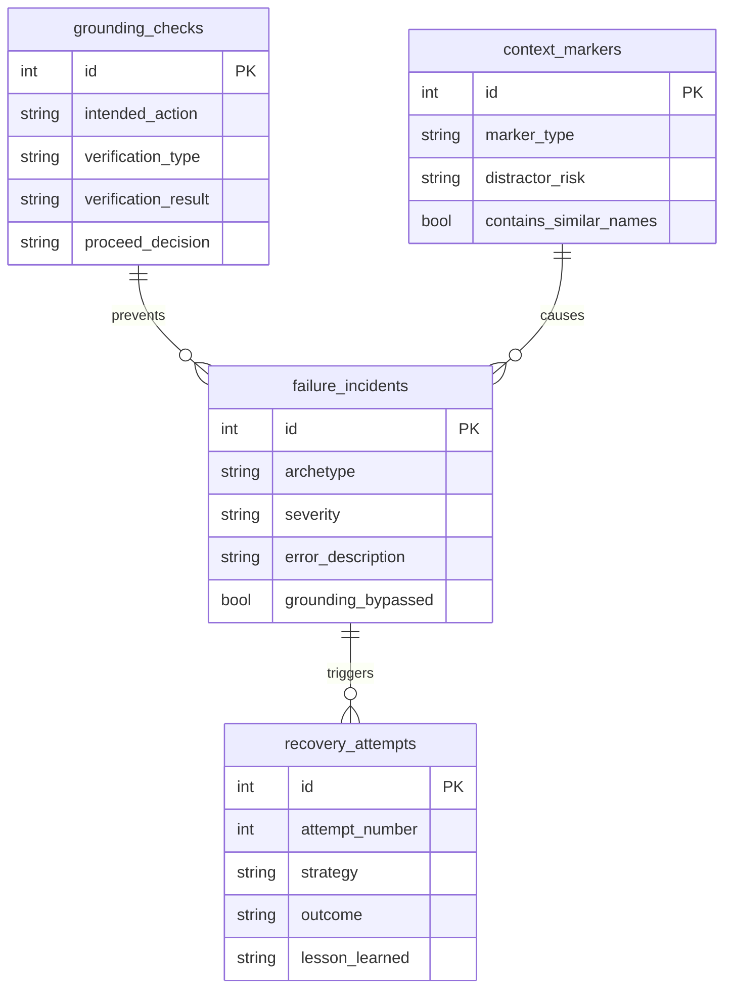

### Prevention Quick Reference

| Before... | ALWAYS... |
|-----------|-----------|
| SQL query | Check schema first |
| File edit | Read file content |
| API call | Check documentation |
| Entity name | Verify exact match |
| Complex task | Checkpoint every 3 actions |

| When... | DO... |
|---------|-------|
| Entity not found | Return 0/null |
| Ambiguous request | ASK for clarification |
| >3 errors in a row | STOP and reassess |
| Similar names | Flag as distractor risk |

---

## API Reference

### Health & Status

```
GET /api/health           # Service health check
GET /api/status           # Full system status
GET /api/dashboard/stats  # Dashboard statistics
```

### DMBT Endpoints

```
GET    /api/dmbt/stats              # Statistics
GET    /api/dmbt/ips                # IP mappings
GET    /api/dmbt/asns               # ASN list
GET    /api/dmbt/asns/:asn          # Single ASN details
GET    /api/dmbt/prefixes           # All prefixes
GET    /api/dmbt/blocklist          # Blocklist entries
POST   /api/dmbt/blocklist          # Add to blocklist
DELETE /api/dmbt/blocklist/:id      # Remove from blocklist
POST   /api/dmbt/agent/start        # Start DMBT agent
POST   /api/dmbt/agent/stop         # Stop DMBT agent
```

### Ghost_Shell Endpoints

```
GET    /api/ghost/stats             # Statistics
GET    /api/ghost/domains           # Tracking domains
GET    /api/ghost/cookies           # Cookie traffic
GET    /api/ghost/fingerprints      # Fingerprint rotations
GET    /api/ghost/requests          # Request log (paginated)
GET    /api/ghost/whitelist         # Whitelist entries
POST   /api/ghost/whitelist         # Add to whitelist
DELETE /api/ghost/whitelist/:id     # Remove from whitelist
POST   /api/ghost/proxy/start       # Start proxy
POST   /api/ghost/proxy/stop        # Stop proxy
```

### Account Management

```
GET  /api/accounts                  # All accounts
GET  /api/subscriptions             # Subscriptions
GET  /api/github/integrations       # GitHub integrations
POST /api/github/scan               # Trigger audit
```

### Knowledge Graph

```
GET  /api/graph/nodes               # All nodes and links
POST /api/graph/nodes               # Create node
POST /api/graph/links               # Create link
```

### AI Tracking

```
GET  /api/ai/usage                  # Usage records
POST /api/ai/usage                  # Record usage
```

---

## Database Schemas

### Database Overview

```mermaid
graph TB
    subgraph Databases["5 SQLite Databases"]
        AEGIS[(aegis.db<br/>15 Prisma models)]
        DMBT[(dmbt.db<br/>ASN/IP/Prefix)]
        GHOST[(ghost.db<br/>Requests/Cookies)]
        CONTEXT[(agent_context.db<br/>Sessions/Actions)]
        TASKS[(project_tasks.db<br/>Tasks/History)]
    end

    AEGIS --- Accounts
    AEGIS --- Subscriptions
    AEGIS --- GitHubIntegrations
    AEGIS --- AIUsage
    AEGIS --- KnowledgeGraph

    DMBT --- IPMappings
    DMBT --- ASNs
    DMBT --- Prefixes
    DMBT --- Blocklist

    GHOST --- Requests
    GHOST --- Cookies
    GHOST --- Fingerprints
    GHOST --- TrackingDomains

    CONTEXT --- Agents
    CONTEXT --- ActivityWindows
    CONTEXT --- ActionLog
    CONTEXT --- ContextSnapshots
    CONTEXT --- FailureTracking

    TASKS --- Projects
    TASKS --- TaskItems
    TASKS --- TaskHistory
```

### Database Locations

```
aegis/
├── database/
│   ├── data/
│   │   └── aegis.db              # Main AEGIS database
│   ├── prisma/
│   │   └── schema.prisma         # Prisma schema (15 models)
│   └── context/
│       ├── agent_context.db      # Agent sessions
│       ├── project_tasks.db      # Task management
│       ├── schema.sql            # Context schema
│       ├── tasks_schema.sql      # Tasks schema
│       └── failure_tracking_schema.sql
├── DMBT/
│   └── DMBT_Agent/data/
│       └── dmbt.db               # Network intelligence
└── Ghost_Shell/
    └── data/
        └── ghost_shell.db        # Request/cookie logs
```

---

## Security Model

### What AEGIS Stores

| Data Type | Stored | Notes |
|-----------|--------|-------|
| Account domains | Yes | Public information |
| Usernames/emails | Yes | For identification |
| **Actual passwords** | **NEVER** | Only "has password" boolean |
| 2FA status | Yes | Security tracking |
| Network intelligence | Yes | ASNs, IPs, prefixes |
| Request logs | Yes | For analysis only |

### What AEGIS Never Stores

- Actual passwords
- Authentication tokens
- Session cookies
- Private keys
- OAuth tokens

### Data Location

**All data is stored locally. No data is sent to external servers.**

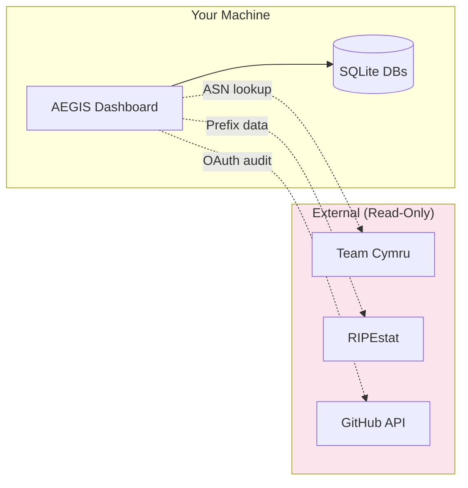

### Encrypted Sync

For multi-machine setups, AEGIS supports encrypted export:

- **Algorithm:** AES-256-GCM
- **Key Derivation:** scrypt
- **Usage:** Export → Encrypt → Cloud → Decrypt → Import

---

## Project Structure

```
aegis/
├── packages/
│   ├── dashboard/              # React + Vite frontend
│   │   ├── src/
│   │   │   ├── pages/          # 15 dashboard pages
│   │   │   ├── components/     # Shared components
│   │   │   └── server/         # Express API + services
│   │   └── package.json
│   ├── browser-parser/         # Browser CSV importer
│   ├── github-auditor/         # GitHub security auditor
│   └── core/                   # Shared utilities, logger
├── database/
│   ├── prisma/                 # Prisma schema
│   ├── data/                   # Main database
│   └── context/                # Agent context databases
├── DMBT/                       # Network blocking toolkit
│   ├── collector/              # Python collectors
│   ├── DMBT_Agent/             # Go agent
│   └── tools/                  # CLI tools
├── Ghost_Shell/                # Application proxy
│   ├── ghost_shell/            # Python proxy code
│   ├── config/                 # Configuration
│   └── data/                   # Proxy database
├── scripts/                    # PowerShell scripts
├── docs/                       # Documentation
└── agents/                     # Agent configurations
```

---

## Tech Stack

| Layer | Technology |
|-------|------------|
| **Frontend** | React 18, Vite, Tailwind CSS, Three.js, Recharts |
| **Backend** | Express.js, Prisma ORM |
| **Database** | SQLite (better-sqlite3) |
| **Network Agent** | Go |
| **Collectors** | Python |
| **Proxy** | mitmproxy, Python |
| **Telemetry** | OpenTelemetry |

---

## CLI Commands

```bash
# Dashboard
npm run dashboard         # Start on localhost:4242

# Database
npm run db:generate       # Regenerate Prisma client
npm run db:push           # Push schema changes
npm run db:studio         # Open Prisma Studio GUI

# Tools
npm run github:audit      # Run GitHub security audit
npm run browser:import    # Import browser passwords (TUI)
npm run browser:scan      # Scan browser locations

# Development
npm run dev               # Start all packages in dev mode
npm run build             # Build all packages
```

---

## Version History

| Version | Date | Changes |
|---------|------|---------|
| **v1.1.0** | 2025-12-09 | Agent context system, failure prevention framework |
| **v1.0.0** | 2025-12-08 | Full DMBT + Ghost_Shell integration, 15 pages |
| **v0.2.0** | 2025-12-08 | 6 new pages, knowledge graph |
| **v0.1.0** | 2025-01-15 | Initial scaffold |

---

## Roadmap

- [ ] Tauri desktop application
- [ ] HaveIBeenPwned breach monitoring
- [ ] Gmail/ProtonMail subscription discovery
- [ ] Claude Agent SDK integration
- [ ] CopyParty file sharing integration
- [ ] VoidTools Everything integration

---

## Contributing

AEGIS is MIT licensed. Contributions welcome!

**Looking for help with:**
- React/TypeScript frontend
- Privacy tooling
- Network security (ASN/BGP)
- Browser extensions
- Python (mitmproxy)
- Go development

---

## License

MIT License - see [LICENSE](LICENSE) for details.

---

## Links

- **GitHub**: [github.com/SoMaCoSF/aegis](https://github.com/SoMaCoSF/aegis)
- **Issues**: [Report bugs](https://github.com/SoMaCoSF/aegis/issues)
- **Documentation**: [docs/AEGIS-PROJECT-GIST.md](docs/AEGIS-PROJECT-GIST.md)

---

<p align="center">
<strong>AEGIS - Because your digital life shouldn't be a mystery.</strong>
<br><br>
Built with Claude Code
</p>
