# AEGIS Privacy Suite - Complete Project Documentation

> **Account & Enterprise Guardian Intelligence System**
>
> Your Digital Footprint, Finally Visible

[](https://github.com/SoMaCoSF/aegis)
[](LICENSE)
[](https://nodejs.org/)
[](https://www.typescriptlang.org/)

---

## Table of Contents

1. [What is AEGIS?](#what-is-aegis)
2. [Architecture Overview](#architecture-overview)
3. [Components](#components)
4. [Agent Context Logging System](#agent-context-logging-system)
5. [LLM Failure Prevention Framework](#llm-failure-prevention-framework)
6. [Database Schemas](#database-schemas)
7. [Quick Start](#quick-start)
8. [API Reference](#api-reference)

---

## What is AEGIS?

Ever wonder how many accounts you've created over the years? Which ones have 2FA? How much you're spending on subscriptions?

**AEGIS is a local-first privacy dashboard that:**

- **Imports accounts** from Chrome/Firefox/Brave/password managers (never stores passwords - only metadata)
- **Tracks subscriptions** and monthly costs across all your services
- **Audits GitHub** OAuth apps, SSH keys, and deploy keys for suspicious access
- **Blocks trackers** at the network layer (entire ASNs, not just domains)
- **Visualizes** your digital footprint in an interactive 3D knowledge graph
- **Encrypted sync** for multi-machine setups (AES-256-GCM)
- **Agent context logging** for AI-assisted development with crash recovery

**All data stays local. No cloud. No telemetry.**

---

## Architecture Overview

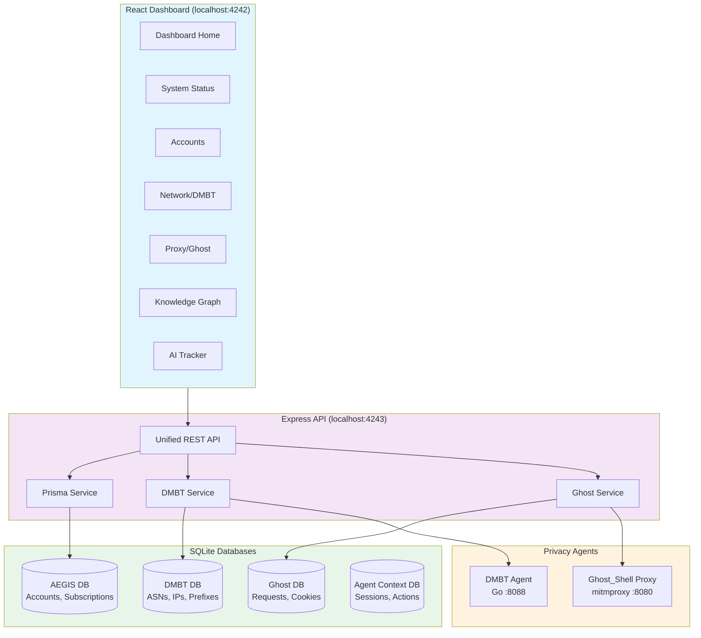

---

## Components

### Component Overview

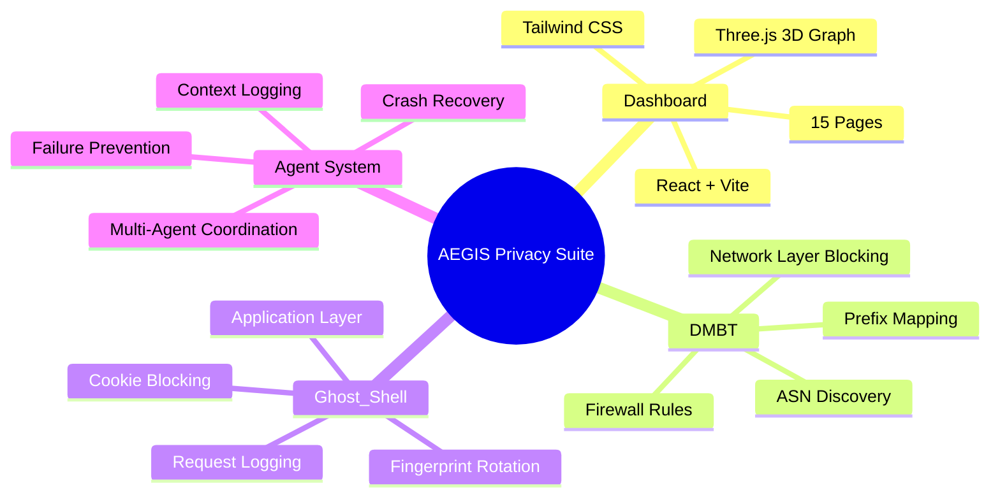

### Dashboard Pages (15)

| Category | Page | Description |
|----------|------|-------------|
| **Core** | Dashboard | Overview with stats and charts |
| | System Status | All integrations health check |
| **Privacy Suite** | Network (DMBT) | ASN/prefix blocking, IP intelligence |
| | Proxy (Ghost) | Fingerprint rotation, cookie blocking |
| | Privacy Exposure | Data broker tracking |
| **Account Management** | Accounts | Imported accounts from browsers |
| | Subscriptions | Recurring payments tracking |
| | Discovery | Account discovery from browsing history |
| **Integrations** | GitHub | OAuth apps and SSH key auditing |
| | Social | Social media account tracker |
| | Finance | Financial/trading accounts |
| | Cloud Storage | Cloud service usage |
| **Tools** | Assistant | Claude Code integration |
| | Knowledge Graph | 3D relationship visualization |
| | AI Tracker | AI usage monitoring |

### DMBT (Delete Me | Block Them)

Network-layer privacy protection:

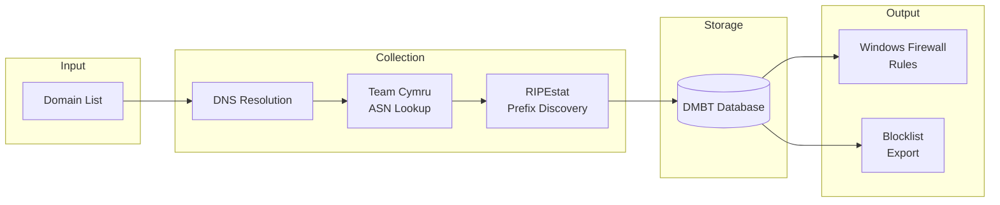

**Current Stats (Live System):**
- 17 domains tracked
- 38 IP mappings
- 5 ASNs discovered
- 25,242 prefixes mapped

### Ghost_Shell

Application-layer privacy protection:

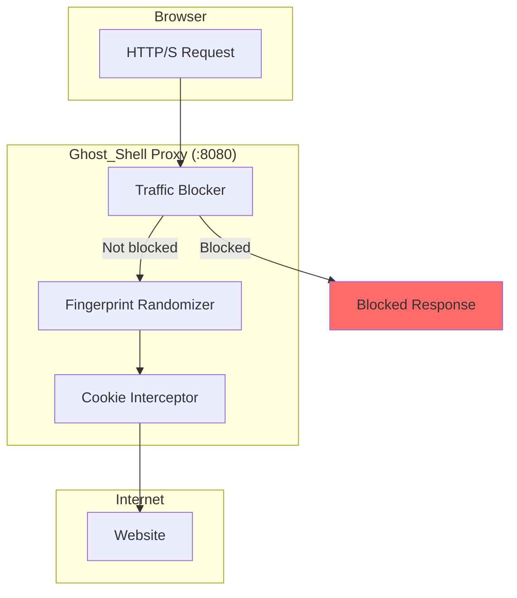

**Fingerprint Rotation Modes:**
1. **Static** - Fixed fingerprint per session
2. **Per-Domain** - Different fingerprint per domain
3. **Per-Request** - New fingerprint every request
4. **Timed** - Rotate every N minutes
5. **Random** - Random rotation timing

---

## Agent Context Logging System

AEGIS includes a comprehensive agent context logging system for AI-assisted development with crash recovery.

### System Architecture

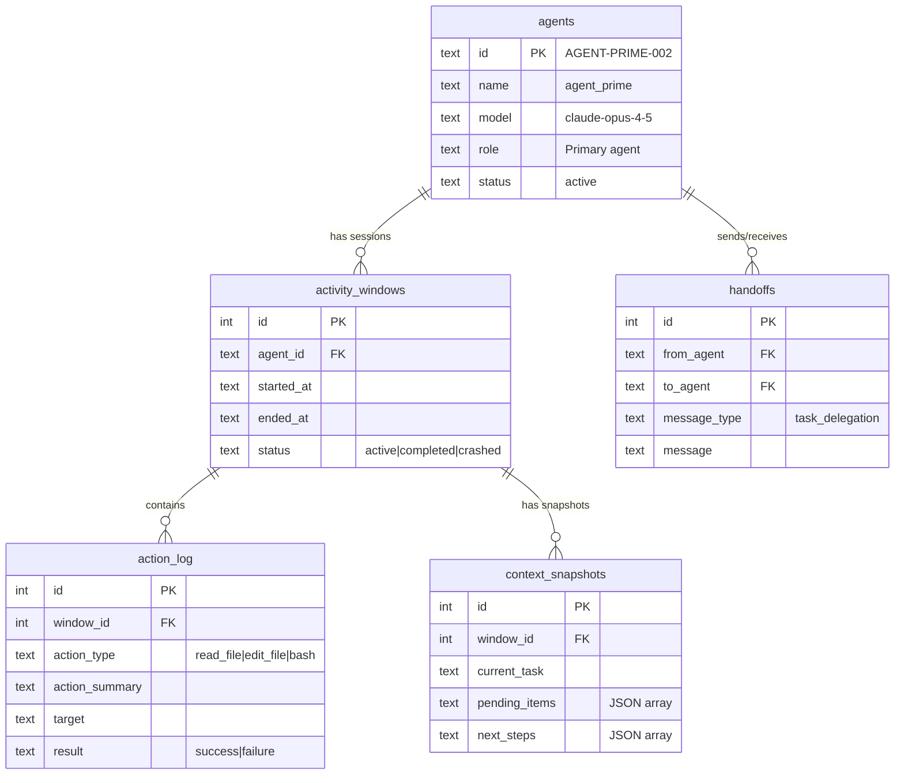

### Agent Session Protocol

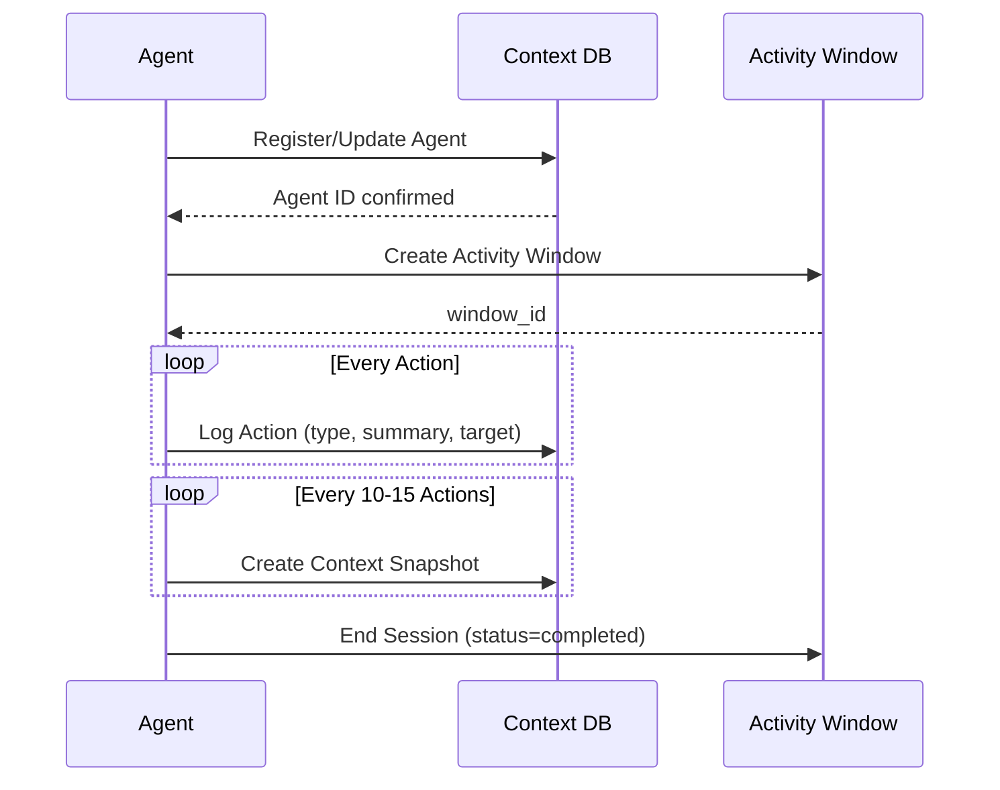

### Crash Recovery

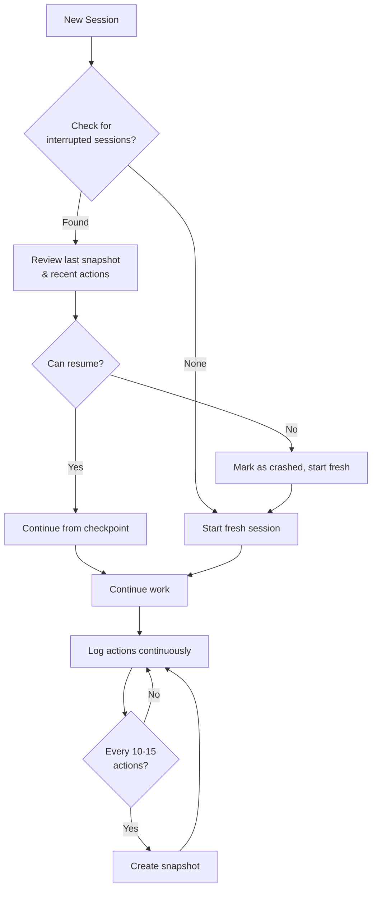

---

## LLM Failure Prevention Framework

Based on research from "How Do LLMs Fail In Agentic Scenarios?" (Kamiwaza AI, 2025).

> **"Recovery capability, not initial correctness, best predicts overall success."**

### The Four Failure Archetypes

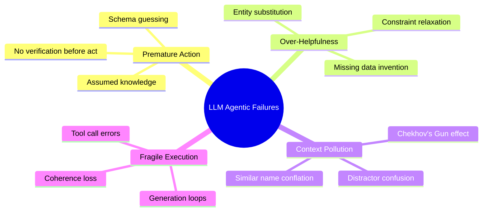

### Archetype 1: Premature Action Without Grounding

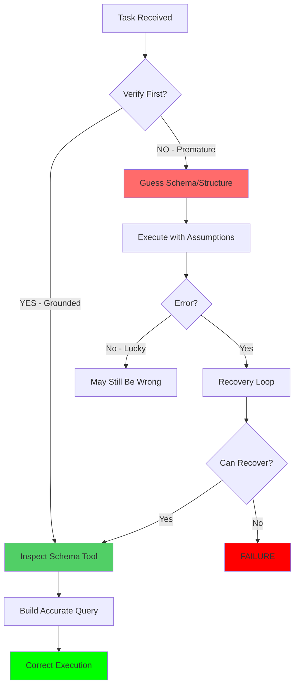

**Prevention:**
| Before... | ALWAYS... |
|-----------|-----------|
| SQL query | `PRAGMA table_info()` or schema read |
| File edit | Read file content first |
| API call | Check docs or test endpoint |
| Using entity name | Verify EXACT match |

### Archetype 2: Over-Helpfulness Under Uncertainty

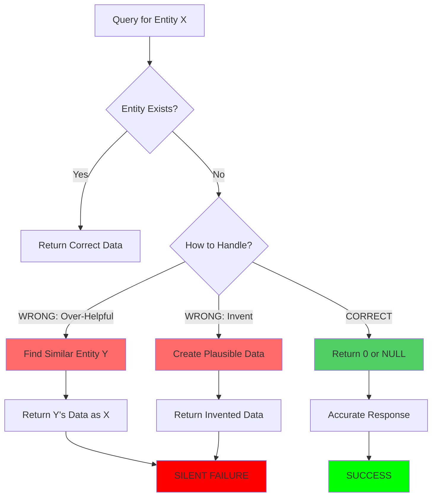

**Prevention:** If uncertain, ASK - do not substitute or invent.

### Archetype 3: Context Pollution (Chekhov's Gun Effect)

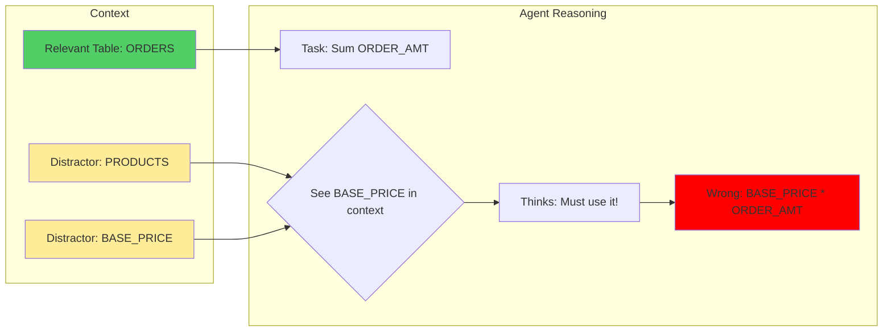

**Key Finding:** Even 671B parameter models are vulnerable. Size ≠ reliability.

### Archetype 4: Fragile Execution Under Load

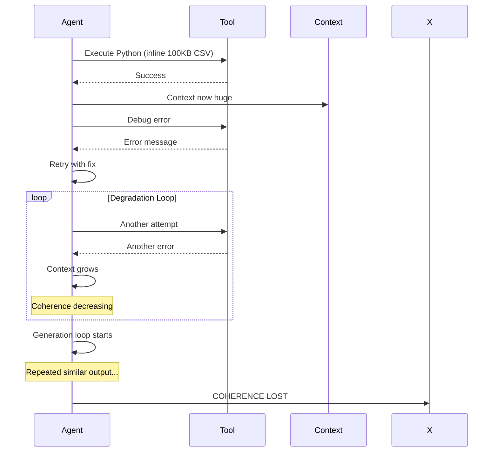

**Prevention:** Checkpoint every 3 actions for complex tasks.

### Recovery: The Key Differentiator

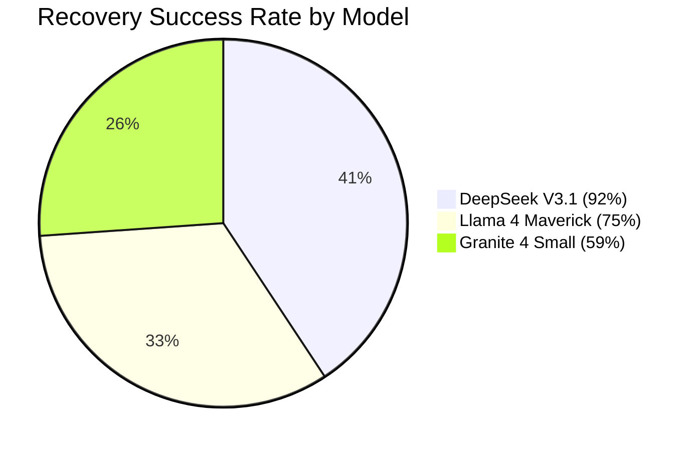

### Failure Tracking Schema

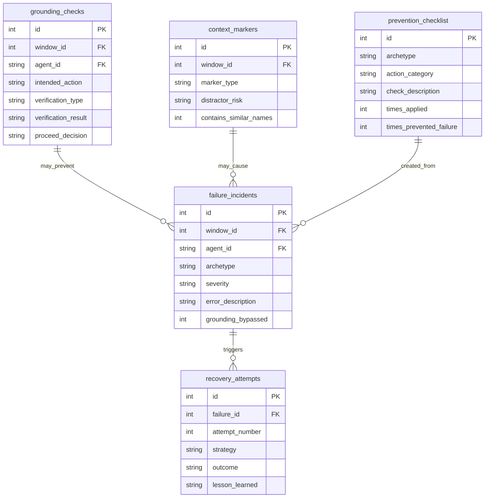

### Quick Reference: Failure Prevention

| Archetype | Prevention | Detection |
|-----------|------------|-----------|
| **Premature Action** | `sqlite_get_schema` BEFORE query | Edit without prior read |
| **Over-Helpful** | Return 0 for missing, don't substitute | "instead of" in reasoning |
| **Context Pollution** | Curate aggressively, exact name match | Similar entity confusion |
| **Fragile Execution** | Checkpoint every 3 actions, no inlining | Repeated similar errors |

---

## Database Schemas

### AEGIS Main Database (Prisma)

15 models including:
- `Account` - Imported accounts from browsers
- `Subscription` - Recurring payments
- `GitHubIntegration` - OAuth apps, SSH keys
- `AIUsage` - AI usage tracking
- `KnowledgeNode` / `KnowledgeLink` - Graph visualization
- `SocialAccount`, `CloudStorage`, `FinancialAccount`

### Agent Context Database

```sql
-- Core tables
agents           -- Agent registry
activity_windows -- Session tracking
action_log       -- Sequential action log
context_snapshots-- Periodic state captures
handoffs         -- Multi-agent coordination

-- Failure tracking tables
grounding_checks     -- Pre-action verification
failure_incidents    -- Classified failures
recovery_attempts    -- Recovery tracking
context_markers      -- Context pollution risk
prevention_checklist -- Learned prevention
```

### DMBT Database

```sql
ip_mappings     -- domain → IP → ASN mappings
asns            -- ASN details with org names
prefix_mappings -- IP prefixes per ASN
blocklist       -- Blocked ASNs/IPs
```

### Ghost_Shell Database

```sql
requests           -- HTTP request log
cookies            -- Cookie traffic
fingerprints       -- Rotation history
tracking_domains   -- Known trackers
whitelist          -- Trusted domains
```

---

## Quick Start

### Prerequisites

- Node.js 20+
- Python 3.12+
- Windows 10/11
- PowerShell 7+

### Installation

```powershell
# Clone and install
git clone https://github.com/SoMaCoSF/aegis.git
cd aegis
npm install

# Generate Prisma client
npm run db:generate

# Push database schema
npm run db:push

# Start dashboard
npm run dashboard
```

### Access Points

| Service | URL |
|---------|-----|
| Dashboard | http://localhost:4242 |
| API | http://localhost:4243 |
| Proxy | 127.0.0.1:8080 |

---

## API Reference

### Health & Status
```
GET /api/health          - Service health check
GET /api/status          - Full system status
GET /api/dashboard/stats - Dashboard statistics
```

### DMBT Endpoints
```
GET  /api/dmbt/stats           - Statistics
GET  /api/dmbt/ips             - IP mappings
GET  /api/dmbt/asns            - ASN list
GET  /api/dmbt/prefixes        - Prefix mappings
GET  /api/dmbt/blocklist       - Blocklist entries
POST /api/dmbt/blocklist       - Add to blocklist
```

### Ghost_Shell Endpoints
```
GET  /api/ghost/stats          - Statistics
GET  /api/ghost/domains        - Tracking domains
GET  /api/ghost/cookies        - Cookie traffic
GET  /api/ghost/fingerprints   - Fingerprints
GET  /api/ghost/requests       - Request log
POST /api/ghost/whitelist      - Add to whitelist
```

### Accounts & Integrations
```
GET  /api/accounts             - All accounts
GET  /api/subscriptions        - Subscriptions
GET  /api/github/integrations  - GitHub integrations
POST /api/github/scan          - Trigger audit
```

---

## Tech Stack

| Layer | Technology |
|-------|------------|
| Frontend | React 18, Vite, Tailwind CSS, Three.js |
| Backend | Express, Prisma, better-sqlite3 |
| Database | SQLite (5 databases) |
| Network | Go (DMBT agent), Python (collectors) |
| Proxy | mitmproxy, Python |
| Telemetry | OpenTelemetry |

---

## Links

- **GitHub**: [github.com/SoMaCoSF/aegis](https://github.com/SoMaCoSF/aegis)
- **Issues**: [Report bugs](https://github.com/SoMaCoSF/aegis/issues)

---

*AEGIS Privacy Suite - Because your digital life shouldn't be a mystery.*

Built with Claude Code
