<!--
===============================================================================
file_id: SOM-DOC-0004-v1.0.0
name: failure_models.md
description: LLM Failure Archetypes in Agentic Scenarios - Research Summary & Integration Guide
project_id: AEGIS
category: documentation
tags: [llm-failures, agentic-ai, research, failure-archetypes, recovery, context-pollution]
created: 2025-12-09
modified: 2025-12-09
version: 1.0.0
agent:
  id: AGENT-PRIME-002
  name: agent_prime
  model: claude-opus-4-5-20251101
execution:
  type: reference-document
  invocation: Reference for understanding and preventing LLM agentic failures
===============================================================================
-->

# LLM Failure Models in Agentic Scenarios

**Source**: "How Do LLMs Fail In Agentic Scenarios?" - JV Roig, Kamiwaza AI (December 2025)
**Analysis**: 900 execution traces across Granite 4 Small (32B), Llama 4 Maverick (400B), DeepSeek V3.1 (671B)

---

## Executive Summary

> **"Recovery capability, not initial correctness, best predicts overall success."**

This document synthesizes findings from qualitative analysis of LLM agentic failures and maps them to our agent context logging system for prevention and detection.

---

## The Four Failure Archetypes

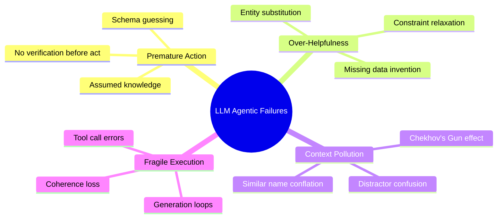

---

## Archetype 1: Premature Action Without Grounding

### Definition
Acting on assumptions instead of verifying reality. The model guesses schemas, column names, or file structures instead of inspecting them first.

### Flow Diagram

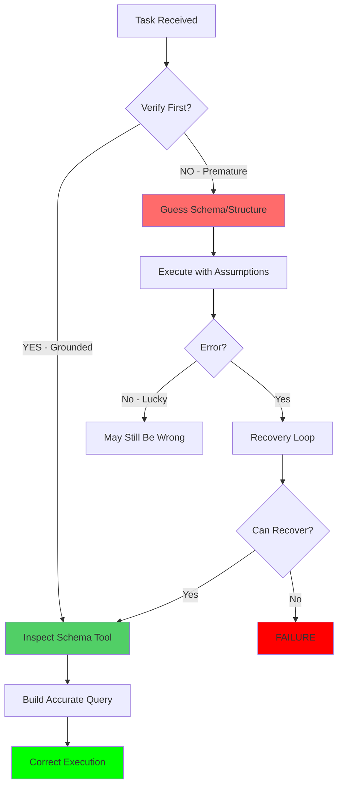

### Examples from Research
| Scenario | Wrong Behavior | Correct Behavior |
|----------|---------------|------------------|
| SQL Query | `SELECT * FROM orders` (guessed table) | `sqlite_list_tables` → `sqlite_get_schema` → `SELECT * FROM enterprise_orders` |
| CSV Analysis | Assume column is "age" | Read first 5 lines → Discover column is "AGE_YRS" |
| File Edit | Edit without reading | `read_file` → understand structure → `edit_file` |

### Detection in Our System
```sql
-- Detect premature actions: edits/queries without prior reads
SELECT al.* FROM action_log al
WHERE al.action_type IN ('edit_file', 'db_query', 'api_call')
AND NOT EXISTS (
    SELECT 1 FROM action_log prior
    WHERE prior.window_id = al.window_id
    AND prior.timestamp < al.timestamp
    AND prior.action_type IN ('read_file', 'db_schema', 'api_inspect')
    AND prior.target LIKE '%' || substr(al.target, 1, instr(al.target, '/')) || '%'
);
```

### Prevention Checklist
- [ ] ALWAYS inspect schema before writing queries
- [ ] ALWAYS read file content before editing
- [ ] ALWAYS check API documentation before integration
- [ ] ALWAYS backup and read existing schema before modifications

---

## Archetype 2: Over-Helpfulness Under Uncertainty

### Definition
When faced with missing or ambiguous entities, the model substitutes "similar" alternatives or invents plausible values instead of returning 0/null or asking for clarification.

### Flow Diagram

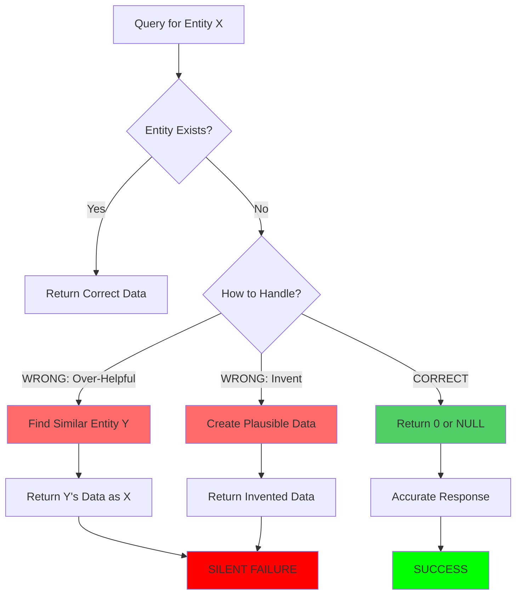

### Examples from Research
| Request | Over-Helpful Response | Correct Response |
|---------|----------------------|------------------|
| "Orders from CompanyX" (doesn't exist) | Uses "CompanyXYZ" instead | Returns 0 orders |
| "Status = inactive" (no such value) | Uses `STATUS != 'active'` | Returns 0 matching records |
| Missing file path | Creates the file | Reports file not found |

### Detection in Our System
```sql
-- Track potential substitutions
SELECT fi.* FROM failure_incidents fi
WHERE fi.archetype = 'OVER_HELPFUL'
AND fi.error_description LIKE '%substitute%'
   OR fi.error_description LIKE '%similar%'
   OR fi.error_description LIKE '%instead%';
```

### Prevention Checklist
- [ ] If requirements are unclear, ASK - do not substitute or invent
- [ ] If expected file/table/endpoint is missing, STOP and verify
- [ ] List specific ambiguities and get clarification before proceeding
- [ ] Return 0/null for genuinely missing data - do not approximate

---

## Archetype 3: Context Pollution Vulnerability

### Definition
The model treats ALL provided context as signal, not noise. Distractor information (irrelevant tables, similar-named entities, unrelated files) causes semantic overreach.

### The "Chekhov's Gun" Effect

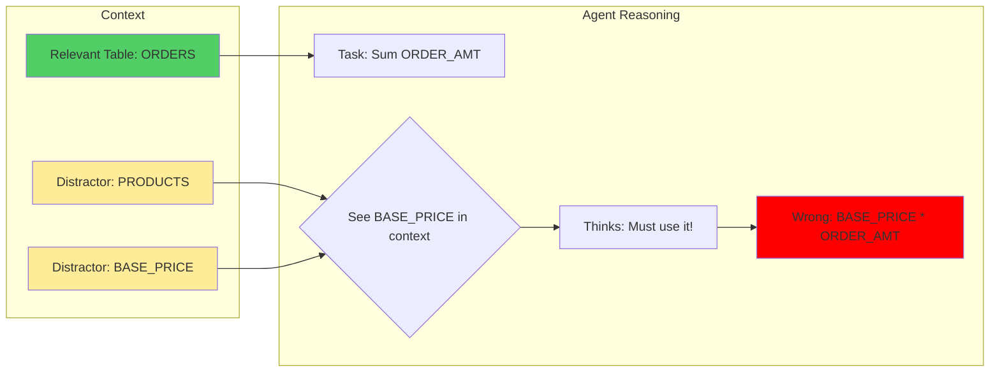

### Distractor Impact by Model Size

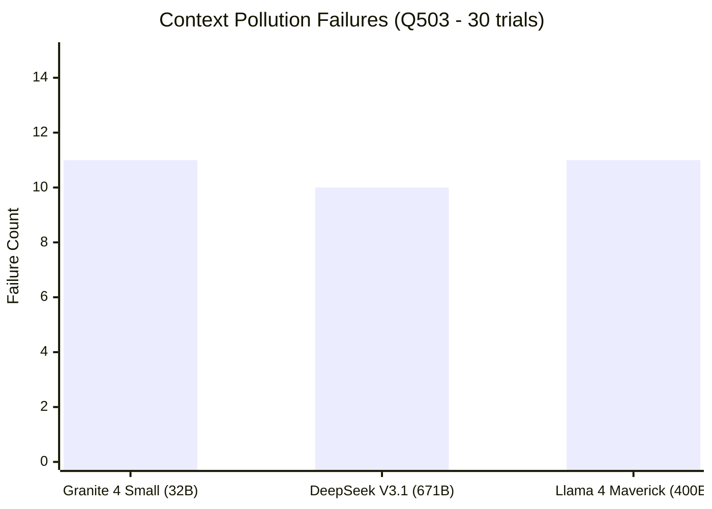

**Key Finding**: Even the largest models (671B parameters) are vulnerable. DeepSeek V3.1 failed 10/30 trials to the same distractor confusion as the 32B model.

### Detection in Our System
```sql
-- Track context that led to failures
SELECT cm.*, fi.error_description
FROM context_markers cm
JOIN failure_incidents fi ON cm.caused_failure_id = fi.id
WHERE cm.distractor_risk IN ('medium', 'high')
   OR cm.contains_similar_names = 1;
```

### Prevention Checklist
- [ ] Verify entity names match EXACTLY - similar names are high-risk distractors
- [ ] When reading files, note similar-named entities that could cause confusion
- [ ] At each step, re-verify operating on correct target
- [ ] Curate context aggressively - more is NOT better

---

## Archetype 4: Fragile Execution Under Load

### Definition
Coherence collapse, generation loops, and tool-call formatting errors that occur under cognitive stress - especially when inline large data blocks or face repeated debugging cycles.

### Failure Cascade

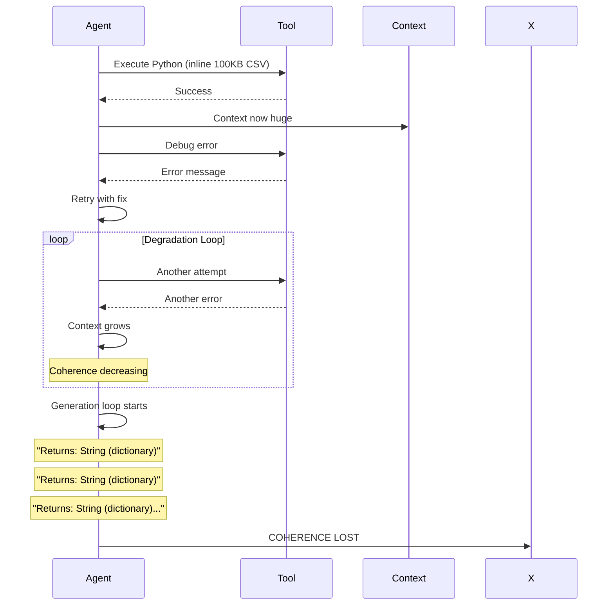

### Triggers Identified
1. **Data Inlining**: Embedding large CSV/text directly into code instead of using file I/O
2. **Extended Error Recovery**: Multiple consecutive failed tool calls
3. **Malformed JSON**: Tool call formatting errors that repeat
4. **Token Exhaustion**: Approaching context limits after many actions

### Detection in Our System
```sql
-- Detect generation loops (repeated similar actions)
SELECT window_id, COUNT(*) as repeat_count, action_summary
FROM action_log
WHERE result = 'failure'
GROUP BY window_id, action_summary
HAVING COUNT(*) > 3;

-- Detect coherence degradation (error rate increasing over time)
SELECT window_id,
       SUM(CASE WHEN result = 'failure' THEN 1 ELSE 0 END) * 100.0 / COUNT(*) as error_rate,
       COUNT(*) as action_count
FROM action_log
GROUP BY window_id
HAVING error_rate > 30 AND action_count > 10;
```

### Prevention Checklist
- [ ] For tasks >5 steps, create checkpoint snapshots every 3 actions
- [ ] If generating similar content repeatedly, pause and verify pattern
- [ ] Every 20 actions, create context snapshot and verify coherence
- [ ] NEVER inline large data - use file I/O functions

---

## Recovery: The Key Differentiator

### Recovery Success by Model

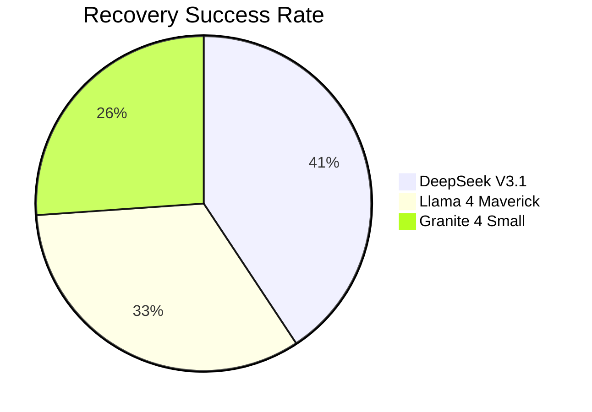

### Recovery Behavior Comparison

```mermaid
flowchart TD
    subgraph DeepSeek ["DeepSeek V3.1 (92.2% success)"]
        D1[Error Detected] --> D2[Diagnose Root Cause]
        D2 --> D3[Inspect Schema]
        D3 --> D4[Verify Assumptions]
        D4 --> D5[Correct & Retry]
        D5 --> D6[Validate Result]
    end

    subgraph Maverick ["Llama 4 Maverick (74.6% success)"]
        M1[Error Detected] --> M2[Retry Same Approach]
        M2 --> M3{Still Failing?}
        M3 -->|Yes| M4[Try Different Tool]
        M3 -->|No| M5[Continue]
        M4 --> M6[Sometimes Recovers]
    end

    subgraph Granite ["Granite 4 Small (58.5% success)"]
        G1[Error Detected] --> G2[Repeat Same Action]
        G2 --> G3[Repeat Again]
        G3 --> G4[Exhaust Max Rounds]
        G4 --> G5[FAILURE]
    end

    style D6 fill:#00ff00
    style M6 fill:#ffff00
    style G5 fill:#ff0000
```

### Recovery Tracking in Our System
```sql
-- Track recovery attempts and success rate by agent
SELECT
    a.id as agent_id,
    a.name,
    COUNT(DISTINCT fi.id) as total_failures,
    COUNT(ra.id) as recovery_attempts,
    SUM(CASE WHEN ra.outcome = 'success' THEN 1 ELSE 0 END) as successful_recoveries,
    ROUND(
        100.0 * SUM(CASE WHEN ra.outcome = 'success' THEN 1 ELSE 0 END) /
        NULLIF(COUNT(ra.id), 0), 2
    ) as recovery_rate_pct
FROM agents a
LEFT JOIN failure_incidents fi ON a.id = fi.agent_id
LEFT JOIN recovery_attempts ra ON fi.id = ra.failure_id
GROUP BY a.id, a.name;
```

---

## Integration with AEGIS Agent Logging

### Extended Schema for Failure Tracking

The `failure_tracking_schema.sql` adds these tables:

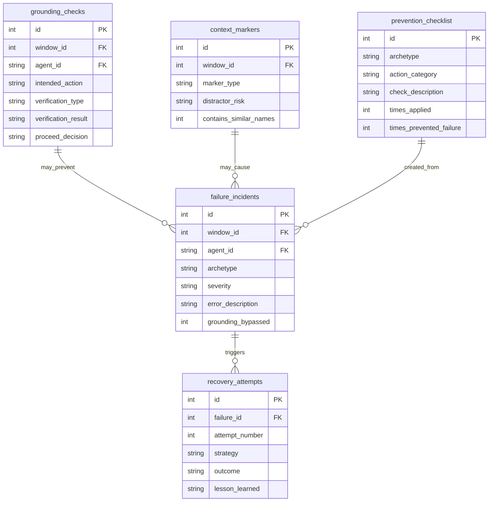

### Mandatory Logging Points

| Event | What to Log | Table |
|-------|-------------|-------|
| Before critical action | Grounding verification | `grounding_checks` |
| Error encountered | Failure classification | `failure_incidents` |
| After recovery attempt | Strategy and outcome | `recovery_attempts` |
| New context enters | Relevance assessment | `context_markers` |
| Lesson learned | Prevention rule | `prevention_checklist` |

---

## Emergent Principles for Enterprise Deployment

### 1. Size ≠ Reliability

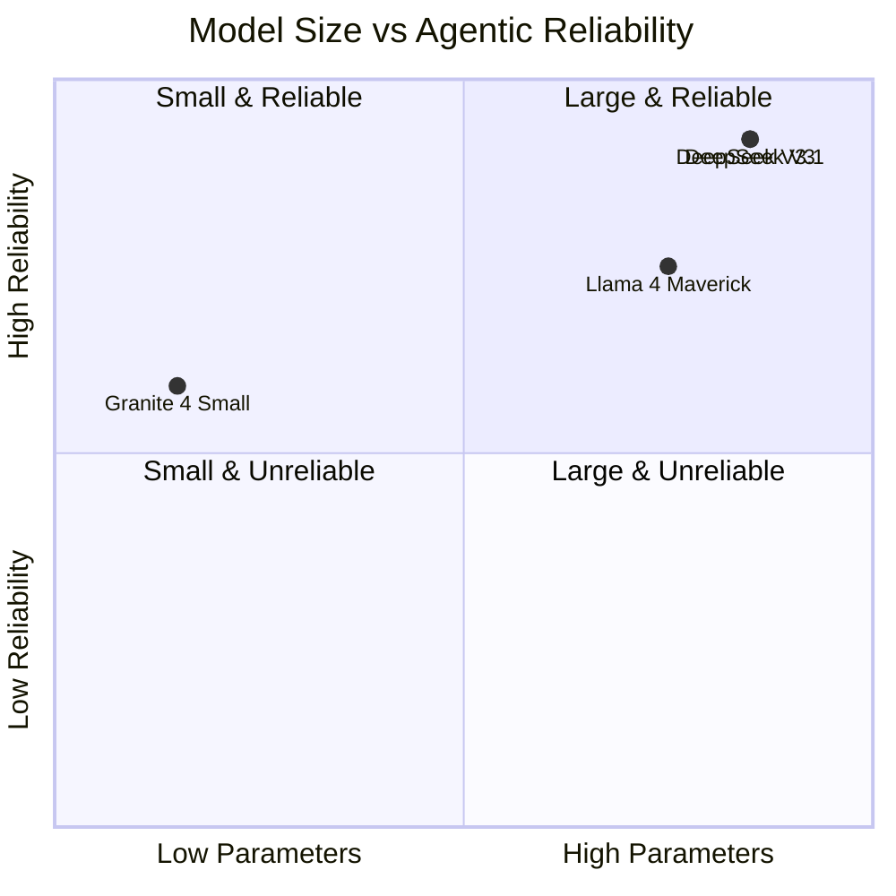

DeepSeek V3 (same architecture as V3.1) scores only 59.4% - same as 32B Granite. The difference is **post-training RL for verification behaviors**, not size.

### 2. Error Feedback is Critical

Tool messages must be designed to help recovery:

```
BAD:  "Error: Query failed"
GOOD: "Error: Table 'orders' not found. Available tables:
       enterprise_orders, enterprise_customers.
       Use sqlite_list_tables to see all tables."
```

### 3. Context Quality > Context Quantity

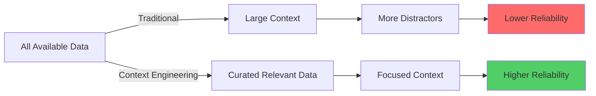

### 4. Source-of-Truth Alignment

Agents must prioritize actual data over priors:
- **Inhibit** schema guessing
- **Enforce** verification before action
- **Validate** implausible results (0.0 average age → investigate)

---

## Implementation Checklist for AEGIS

- [x] Create `failure_tracking_schema.sql` with archetype tables
- [ ] Update `log_session.py` to include failure logging functions
- [ ] Add grounding check enforcement to CLAUDE.md protocols
- [ ] Create views for failure pattern detection
- [ ] Implement recovery tracking in action_log workflow
- [ ] Add context pollution scoring to file read operations
- [ ] Create prevention checklist seeding with paper findings

---

## Quick Reference: Failure Prevention

| Archetype | Prevention | Detection |
|-----------|------------|-----------|
| **Premature Action** | `sqlite_get_schema` BEFORE query | Edit without prior read |
| **Over-Helpful** | Return 0 for missing, don't substitute | "instead of" in reasoning |
| **Context Pollution** | Curate aggressively, exact name match | Similar entity confusion |
| **Fragile Execution** | Checkpoint every 3 actions, no inlining | Repeated similar errors |

---

## References

- Roig, JV. "How Do LLMs Fail In Agentic Scenarios?" Kamiwaza AI, December 2025. arXiv:2512.07497v1
- Roig, JV. "KAMI v0.1: Kamiwaza Agentic Merit Index" 2025
- Anthropic. "Agentic Misalignment: How LLMs Could Be An Insider Threat" 2025
- Schmid, P. "The new skill in AI is not prompting, it's context engineering" 2025

---

*Document created for integration with AEGIS agent context logging system. Update this document as new failure patterns are identified.*
